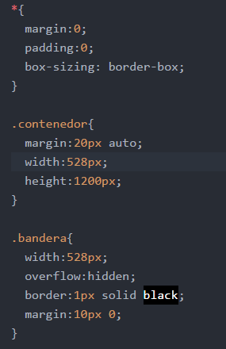
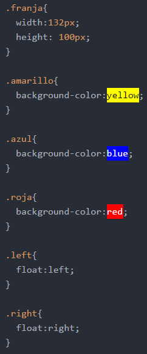
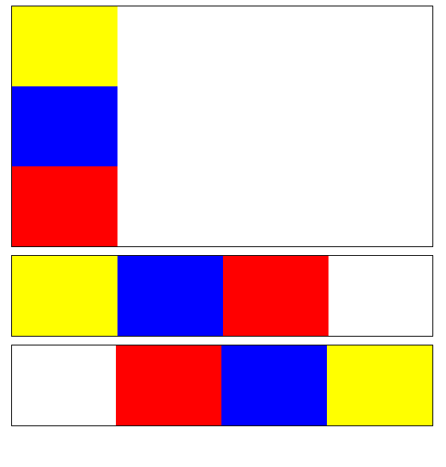

# LaBandera
Es un ejemplo de como utilizar la propiedad "float". Para cada ejercicio he colocado un div que tiene una clase que indica el número de bandera que es.(Ejemplo class="bandera 1").
- Clase bandera: Esta clase es la que contiene a los div de las franjas de colores, va a tener un width y un height establecido.
- Clase franja: Esta clase es la que tiene los colores para cada franja de la bandera, tiene un width y un height establecido.
- Clases flotantes (.left y .right): Estas clases tienen como única propiedad el float (left/right) respectivamente.

## Un poco del CSS
------------------------

### Cómo hacemos el div de la bandera.
Notarás en la imagen del código que hay una clase contenedor, ésta la coloque para centrar los elementos como un todo; hay otras formas de hacerlo pero ésta era para mi la más cómoda.
La clase bandera tiene propiedades como altura, ancho, borde y un overflow "hidden" para que contenga a sus elementos (esto nos servirá con los flotantes).

### Clase franja...y color para cada franja.
 En la clase franja encontrarás que hay propiedades de ancho y alto; para el color hemos creado una clase con el nombre del color que "pintará" el div (.amarillo{ background-color:amarillo;}).  

### Floats.
 En la imagen encontrarás la clase como .left o .right dependiendo de hacia donde va a flotar el elemento.

Este es el resultado final.

## Autor: Stephanie Hiyagon.
